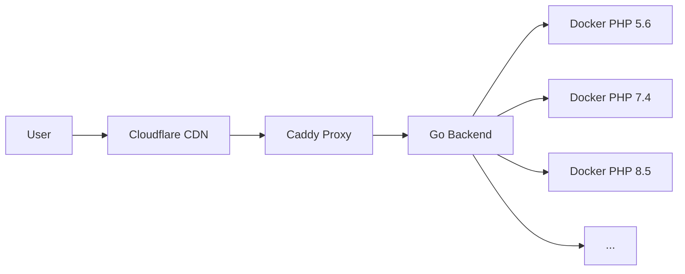

# PHP Online Playground

🚀 **Live Demo:** [phprun.cloud](https://phprun.cloud)

A comprehensive online PHP executor supporting 12 PHP versions (5.6-8.5) with 1,290 built-in functions, security hardening, and instant execution.

## ✨ Features

- **🐘 12 PHP Versions**: Test across PHP 5.6, 7.0-7.4, 8.0-8.5
- **⚡ Instant Execution**: Sub-second response time with Docker containers
- **🛡️ Security First**: Isolated execution, rate limiting, code scanning
- **📱 Mobile Friendly**: Responsive design for all devices
- **🎨 Dark/Light Theme**: Toggle with localStorage persistence
- **🔍 1,290 Functions**: Complete PHP function reference with examples

## 🎯 Quick Examples

Try these specialized tools:

| Function | Live Demo | Description |
|----------|-----------|-------------|
| **MD5** | [md5.phprun.cloud](https://md5.phprun.cloud) | Generate MD5 hashes instantly |
| **JSON Encode** | [json-encode.phprun.cloud](https://json-encode.phprun.cloud) | Convert data to JSON format |
| **Base64 Encode** | [base64-encode.phprun.cloud](https://base64-encode.phprun.cloud) | Encode text to Base64 |
| **Date Format** | [date.phprun.cloud](https://date.phprun.cloud) | Format dates with live preview |
| **String Replace** | [str-replace.phprun.cloud](https://str-replace.phprun.cloud) | Find and replace in text |

## 🏗️ Architecture



- **Frontend**: Vanilla JS + CodeMirror editor
- **Backend**: Go server with security middleware
- **Execution**: Isolated Docker containers (64MB RAM limit)
- **CDN**: Cloudflare with CSP protection
- **Monitoring**: Yandex.Metrika + Google Analytics

## 🔧 Tech Stack

- **Language**: Go (backend), JavaScript (frontend)
- **Editor**: CodeMirror 5 with PHP syntax highlighting
- **Containerization**: Docker with security constraints
- **Proxy**: Caddy with automatic HTTPS
- **Analytics**: Yandex.Metrika, Google Analytics
- **Security**: Custom ban manager, code scanner, honeypots

## 🛡️ Security Features

- ✅ **Isolated Execution**: `--read-only --network=none --memory=64m`
- ✅ **Code Scanning**: Detects dangerous functions and infinite loops
- ✅ **Rate Limiting**: Per-IP execution limits with automatic banning
- ✅ **Input Validation**: Parameter type checking and sanitization
- ✅ **CSP Headers**: Content Security Policy preventing XSS
- ✅ **User Isolation**: Service runs as non-root user

## 📊 Coverage

| Metric | Count |
|--------|-------|
| PHP Versions | 12 (5.6—8.5) |
| Total Functions | 1,290 |
| Functions with Constants | 152 |
| Functions with Format Helpers | 15 |
| Subdomain Tools | 29 |
| SEO Pages | 16,566 |

## 🚀 Quick Start

### Online (Recommended)
Just visit [phprun.cloud](https://phprun.cloud) and start coding!

### Self-Hosting
```bash
git clone https://github.com/yourusername/phprun-cloud
cd phprun-cloud
go build -o runphp .
./runphp
```

Visit `http://localhost:8080`

## 📝 Examples

### Basic Usage
```php
<?php
// Test across different PHP versions
echo "PHP " . PHP_VERSION . "\n";
echo date('Y-m-d H:i:s') . "\n";
echo json_encode(['hello' => 'world']);
```

### Function Testing
```php
<?php
// Test specific functions with parameters
$data = ['apple', 'banana', 'cherry'];
echo implode(', ', $data) . "\n";
echo str_replace('banana', 'orange', implode(', ', $data));
```

### Format Strings
```php
<?php
// Date formatting with helpers
echo date('Y-m-d H:i:s') . "\n";
printf("Hello %s, today is %s\n", 'World', date('Y-m-d'));
```

## 🎨 Screenshots

**Main Editor:**


**Function Browser:**
Available at [phprun.cloud/functions](https://phprun.cloud/functions)

## 🤝 Contributing

This is a demonstration project. For issues or suggestions:

1. Open an issue with detailed description
2. Include PHP version and browser information
3. Provide minimal reproduction steps

## 📄 License

This project is available for educational and demonstration purposes.

## 🔗 Links

- **Main Site**: [phprun.cloud](https://phprun.cloud)
- **Function Browser**: [phprun.cloud/functions](https://phprun.cloud/functions)
- **Documentation**: Available in the repository
- **Status**: [](https://phprun.cloud)

---

**Made with ❤️ for the PHP community**

Try it now: [phprun.cloud](https://phprun.cloud) 🎯
